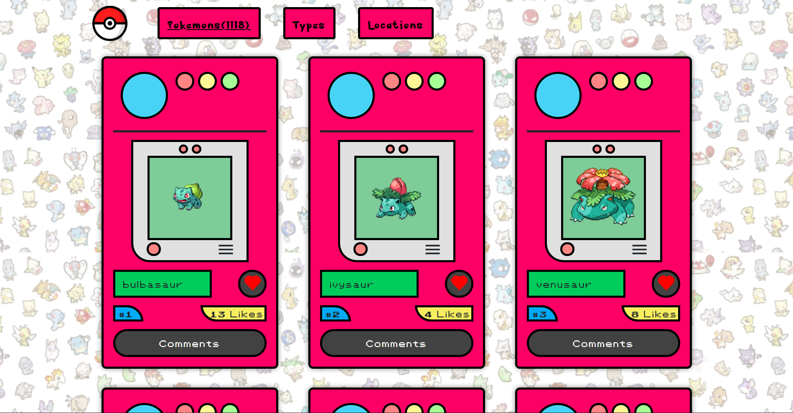
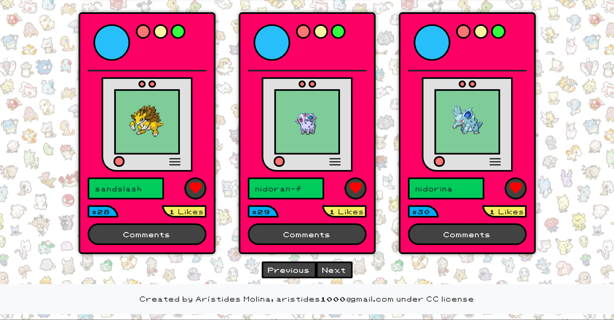
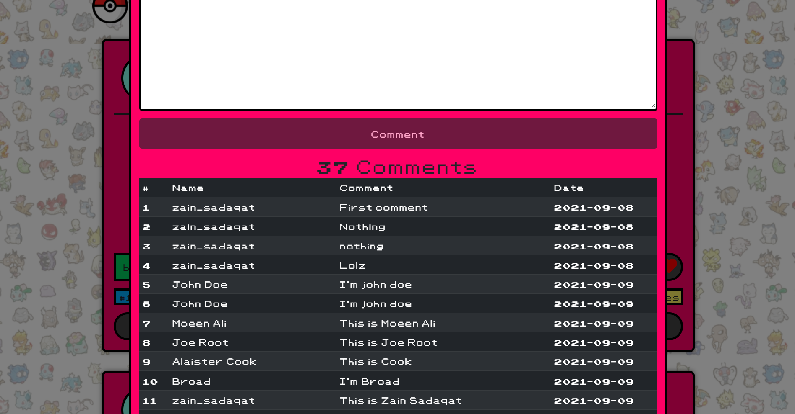

# Pokedex Javascript Capstone Project

> This is a JavaScript project in which a user can see a list of all existing Pokémon and can add likes to their favorite Pokémon, this application was made with the API service called PokeAPI.





## Built With

- HTML
- CSS
- JavaScript
- ESLint
## Live Demo

[Live Demo Link](https://rawcdn.githack.com/zainsadaqat/javascript-capstone-pokeapi/9c23e92fb394f561100659025d7f10774130146d/dist/index.html)

## Video
[Explaining Video Link](https://www.youtube.com/watch?v=eNB1iGhPN7Y&ab_channel=aristidesjosemolinaperez)


## Getting Started
1. Clone this repo on your local machine

2. In the path where your repository is located, you will open your terminal.

3. In the path where your repository is located you are going to open your terminal and put "npm install" hit enter, after that type the command "npm start".

4. Enjoy.

## How did I get the API key?

1. Open the developer tools of your favorite browser and go to the console tab.

2. Put the following code inside the console:

```
fetch('https://us-central1-involvement-api.cloudfunctions.net/capstoneApi/apps/', {
  method: 'POST',
  headers: {
    'Content-type': 'text/html',
  },
})
  .then((res) => res.text())
  .then((text) => text);
```

3. Hit Enter.


```
[[Prototype]]: Promise
[[PromiseState]]: "fulfilled"
[[PromiseResult]]: "jycTbGhuwe4GB4mBDbSf"
```

5. And this way you can get your API key 🥳🥳🥳.

### Prerequisites
To make this repository working in your local machine you need only a browser.

## Author

👤 **Arístides José Molina Pérez**

- Github: [@aristides1000](https://github.com/aristides1000)
- Twitter: [@aristides_1000](https://twitter.com/aristides_1000)
- Linkedin: [Aristides Jose Molina Perez](https://www.linkedin.com/in/aristides-molina/)

👤 **Zain Sadaqat**

- Github: [@zainsadaqat](https://github.com/zainsadaqat)
- Twitter: [@zain_sadaqat](https://twitter.com/zain_sadaqat)
- Linkedin: [zain-sadaqat](https://www.linkedin.com/in/zain-sadaqat/)

## 🤝 Contributing

Contributions, issues and feature requests are welcome!

Feel free to check the [issues page](https://github.com/zainsadaqat/javascript-capstone-pokeapi/issues).


## Show your support

Give a ⭐️ if you like this project!

## Acknowledgments

- Ariel Camus CEO Microverse: For letting us start this journey.
- Pokemon: For making an excellent series and video games that made my childhood happy.
- Google: For letting us find crucial information in order to create this project.

## 📝 License

This project is [CC0-1.0](LICENSE) licensed.
